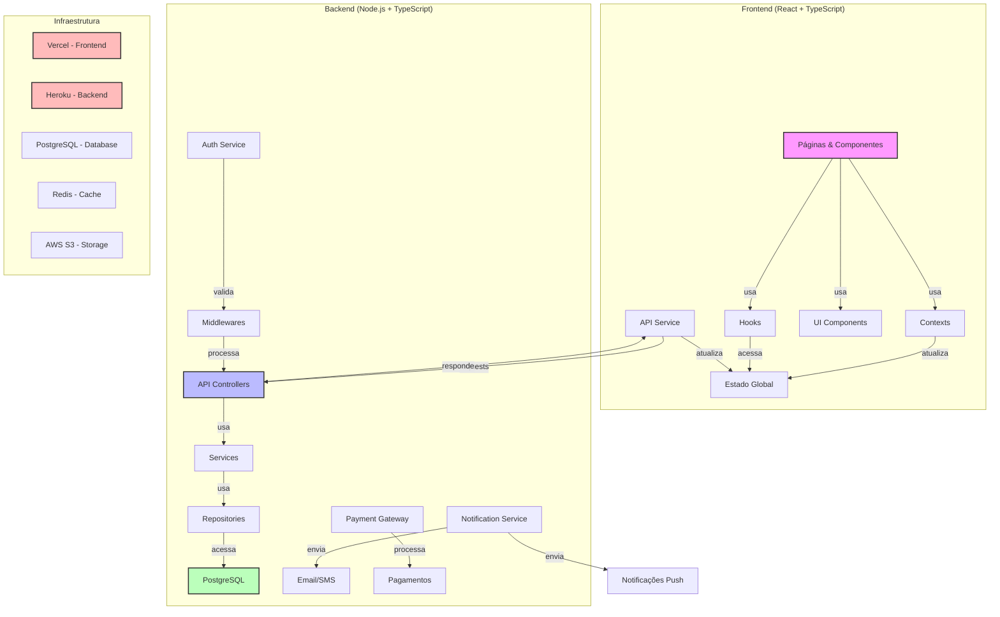
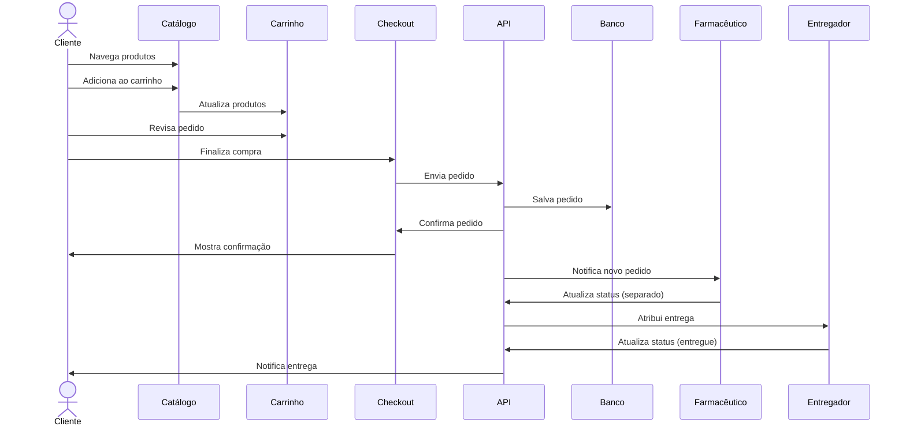
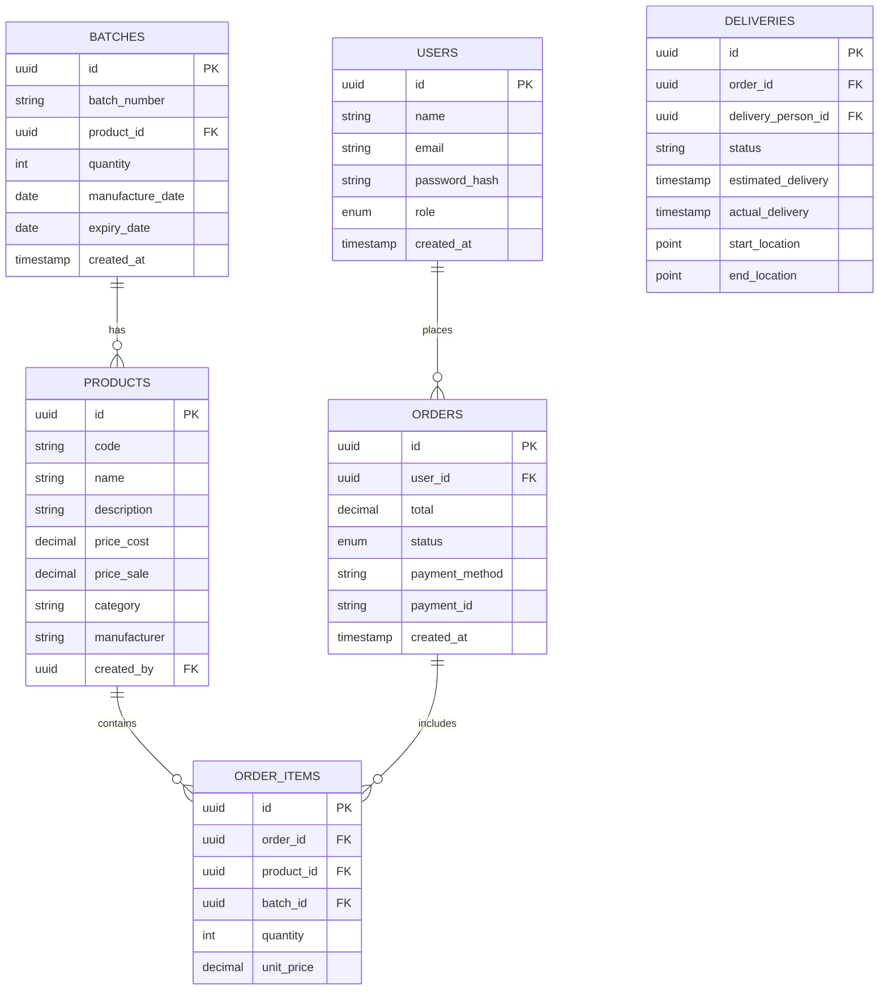

# Diagrama de Arquitetura do PharmaGest

```mermaid
graph TD
    subgraph "Frontend (React + TypeScript)"
        A[Páginas & Componentes] --> |usa| B[Contexts]
        A --> |usa| C[Hooks]
        A --> |usa| D[UI Components]
        B --> |atualiza| E[Estado Global]
        C --> |acessa| E
        F[API Service] --> |atualiza| E
    end

    subgraph "Backend (Node.js + TypeScript)"
        G[API Controllers] --> |usa| H[Services]
        H --> |usa| I[Repositories]
        I --> |acessa| J[PostgreSQL]
        K[Middlewares] --> |processa| G
        L[Auth Service] --> |valida| K
        M[Notification Service] --> |envia| N[Email/SMS]
        O[Payment Gateway] --> |processa| P[Pagamentos]
    end

    subgraph "Infraestrutura"
        Q[Vercel - Frontend]
        R[Heroku - Backend]
        S[PostgreSQL - Database]
        T[Redis - Cache]
        U[AWS S3 - Storage]
    end

    F --> |requests| G
    G --> |responde| F
    M --> |envia| V[Notificações Push]

    style A fill:#f9f,stroke:#333,stroke-width:2px
    style G fill:#bbf,stroke:#333,stroke-width:2px
    style J fill:#bfb,stroke:#333,stroke-width:2px
    style Q fill:#fbb,stroke:#333,stroke-width:2px
    style R fill:#fbb,stroke:#333,stroke-width:2px
```

## Fluxo de Usuário - Compra Online

```mermaid
sequenceDiagram
    actor Cliente
    participant Catálogo
    participant Carrinho
    participant Checkout
    participant API
    participant Banco
    participant Farmacêutico
    participant Entregador

    Cliente->>Catálogo: Navega produtos
    Cliente->>Catálogo: Adiciona ao carrinho
    Catálogo->>Carrinho: Atualiza produtos
    Cliente->>Carrinho: Revisa pedido
    Cliente->>Checkout: Finaliza compra
    Checkout->>API: Envia pedido
    API->>Banco: Salva pedido
    API->>Checkout: Confirma pedido
    Checkout->>Cliente: Mostra confirmação
    API->>Farmacêutico: Notifica novo pedido
    Farmacêutico->>API: Atualiza status (separado)
    API->>Entregador: Atribui entrega
    Entregador->>API: Atualiza status (entregue)
    API->>Cliente: Notifica entrega
```

## Estrutura de Dados Simplificada

```mermaid
erDiagram
    USERS ||--o{ ORDERS : places
    USERS {
        uuid id PK
        string name
        string email
        string password_hash
        enum role
        timestamp created_at
    }
    
    PRODUCTS ||--o{ ORDER_ITEMS : contains
    PRODUCTS {
        uuid id PK
        string code
        string name
        string description
        decimal price_cost
        decimal price_sale
        string category
        string manufacturer
        uuid created_by FK
    }
    
    BATCHES ||--o{ PRODUCTS : has
    BATCHES {
        uuid id PK
        string batch_number
        uuid product_id FK
        int quantity
        date manufacture_date
        date expiry_date
        timestamp created_at
    }
    
    ORDERS ||--o{ ORDER_ITEMS : includes
    ORDERS {
        uuid id PK
        uuid user_id FK
        decimal total
        enum status
        string payment_method
        string payment_id
        timestamp created_at
    }
    
    ORDER_ITEMS {
        uuid id PK
        uuid order_id FK
        uuid product_id FK
        uuid batch_id FK
        int quantity
        decimal unit_price
    }
    
    DELIVERIES {
        uuid id PK
        uuid order_id FK
        uuid delivery_person_id FK
        string status
        timestamp estimated_delivery
        timestamp actual_delivery
        point start_location
        point end_location
    }
```
